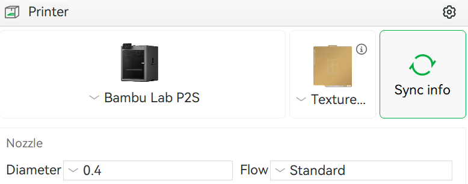
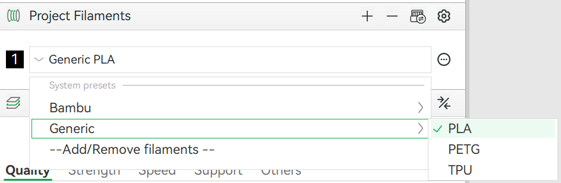

# 3D Printing at RPC (Rapid Prototyping Centre)

For events hosted by the IDEAs Clinic, it is most likely that machines at the RPC (Rapid Prototyping Centre) will be used for your 3D printing needs.

To ensure a successful print, please follow the following guide carefully.

If you need help with designing your model and/or slicing your print, please do not hesitate to reach out to one of the IDEAs Clinic Co-op students for assistance.

## Constraints

Before you design your 3D model, here are some things that you should know.

1. The [Bambu Lab P2S](https://ca.store.bambulab.com/products/p2s?srsltid=AfmBOopzpP6Jb3JHUKiaJUwVgw2HX16ymR28EkrGMFM9a0-rQs7stv8X) printers that we have access to have a print volume of **256 &times; 256 &times; 256 mm3**. Please make sure that your model fits within this volume.
2. Filament types available to print in are:
   - [PLA](https://ca.elegoo.com/collections/filaments/products/pla-filament-1-75mm-colored-1kg) (black, white, grey)
   - [PETG](https://ca.elegoo.com/collections/filaments/products/rapid-petg-filament-1-75mm-colored-1kg) (black, white, grey)
   - [TPU](https://ca.elegoo.com/collections/filaments/products/rapid-tpu-filament-1-75mm-colored-1kg?_pos=4&_fid=009e58b82&_ss=c) (white)

## Slicer Settings

Please download the [Bambu Studio](https://bambulab.com/en/download/studio) slicing software to slice your 3D model for printing.

In the Prepare tab, select the `Bambu Lab P2S` printer and the `Textured PEI Plate`.

Choose the filament of your choosing from the `Generic` presets tab, and then you may start slicing.

## Ready to Print?

When you are finished with slicing your print, flag down one of the IDEAs Clinic student co-op helpers who will review your print settings.
Once we check that all is good, we will export your `.3mf` file onto one of our USB sticks and then take them to the RPC for printing. 
Please sit tight, and we will bring the printed part once it is finished.

If a print fails, we will do our best to troubleshoot the model and printing settings with you.

For more general help regarding 3D modelling and printing, please refer to [this document](GUIDE.md).